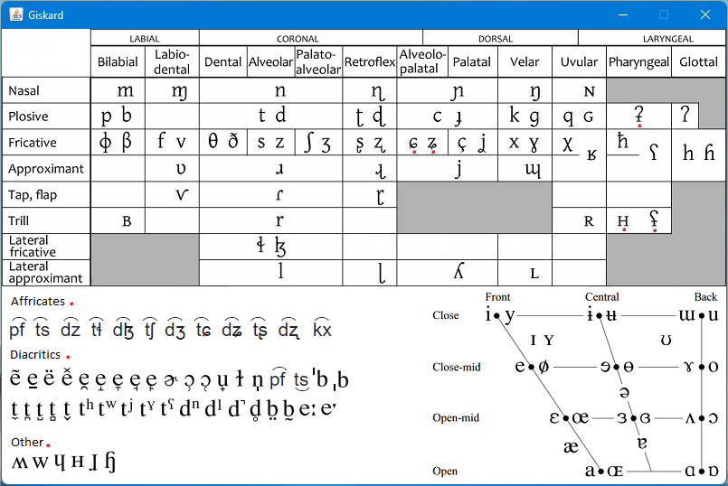

## An app to help insert IPA symbols in the clipboard 

The app displays the IPA alphabet in the main window

* Just click on the symbol and it will be inserted in the clipboard.
* Using the Ctrl key you can add a diacritic or any other symbol together with the first symbol.
* Using the Shift key it emits the phoneme's word initial sound.
* Using the Alt key it emits the phoneme's word internal sound.

The red dot indicates sounds not yet present